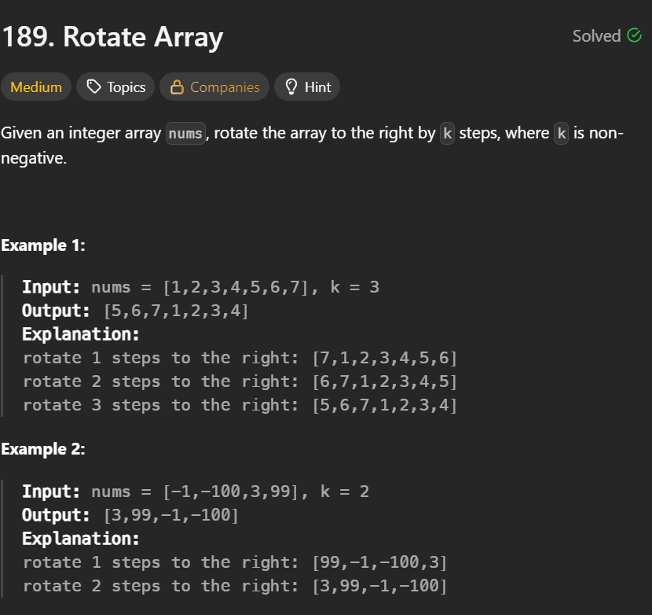
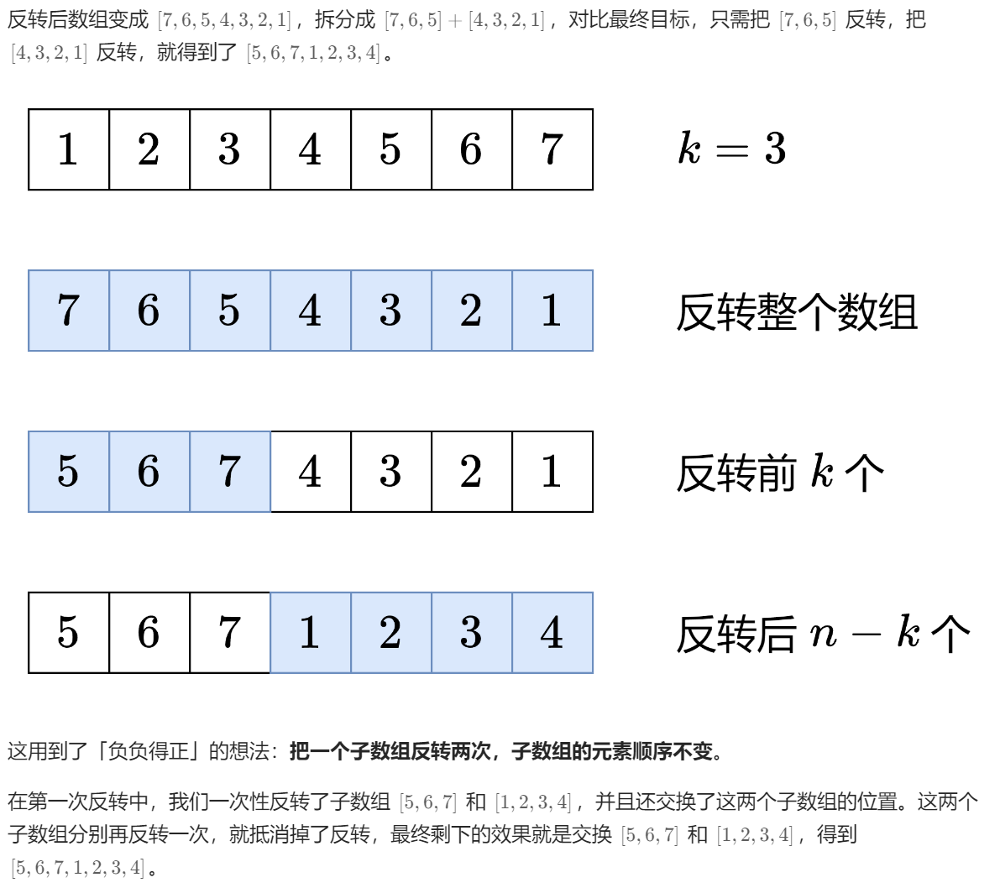

**刷题日期**：2026-2-24
**难度**：Medium

## 题目截图：
---


## 参考答案：
---
```python
class Solution:
    def rotate(self, nums: List[int], k: int) -> None:
        def reverse(i: int, j: int) -> None:
            while i < j:
                nums[i], nums[j] = nums[j], nums[i]
                i += 1
                j -= 1
  
        n = len(nums)
        k %= n  # 轮转 k 次等于轮转 k % n 次
        reverse(0, n - 1)
        reverse(0, k - 1)
        reverse(k, n - 1)
```
时间复杂度O(n)，空间复杂度O(1)
翻转两次
