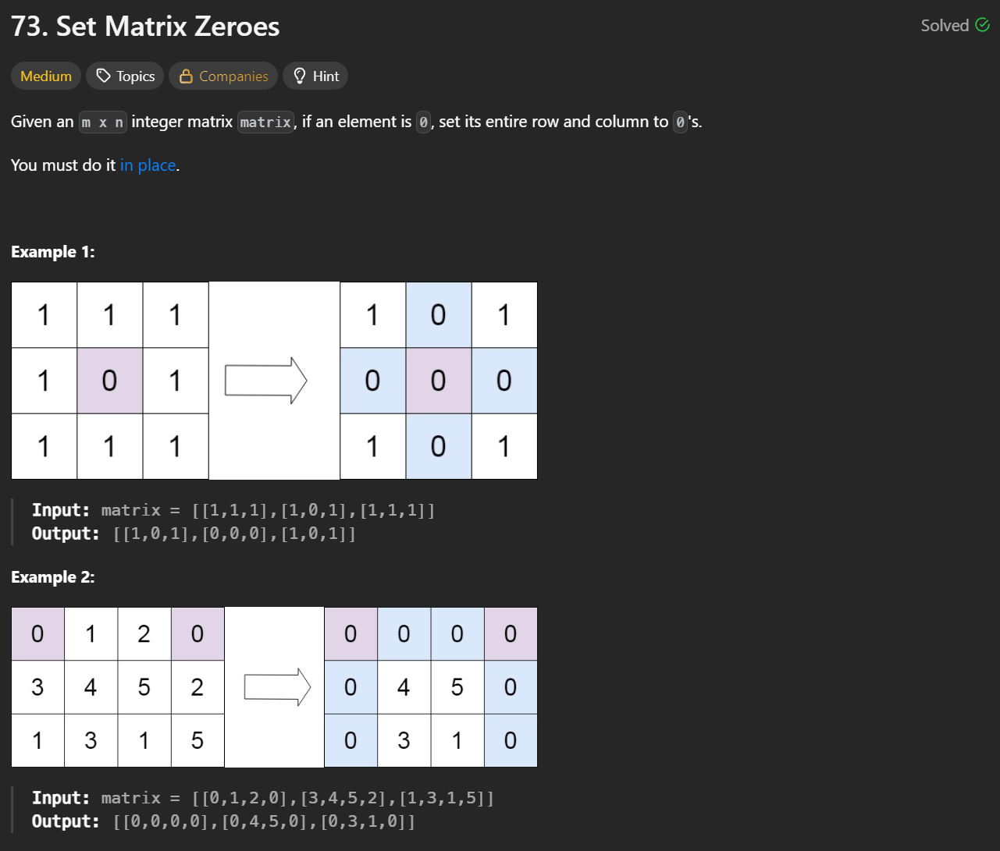

**刷题日期**：2026-2-24
**难度**：Medium

## 题目截图：
---


## 参考答案：
---
方法一（使用额外数组）
```python
class Solution:
    def setZeroes(self, matrix: List[List[int]]) -> None:
        """
        Do not return anything, modify matrix in-place instead.
        """
        row_has_zero = [0 in row for row in matrix]  # 行是否包含 0 (for row in matrix 每次循环 row =[])
        col_has_zero = [0 in col for col in zip(*matrix)]  # 列是否包含 0
  
        for i, row0 in enumerate(row_has_zero):
            for j, col0 in enumerate(col_has_zero):
                if row0 or col0:  # i 行或 j 列有 0
                    matrix[i][j] = 0  # 题目要求原地修改，无返回值
```
时间复杂度O(mn)，空间复杂度O(m+n)

方法二（不适用额外数组）：
写法一
```python
class Solution:
    def setZeroes(self, matrix: List[List[int]]) -> None:
        m, n = len(matrix), len(matrix[0])
        first_row_has_zero = 0 in matrix[0]  # 记录第一行是否包含 0
        first_col_has_zero = any(row[0] == 0 for row in matrix)  # 记录第一列是否包含 0
  
        # 用第一列 matrix[i][0] 保存 row_has_zero[i]
        # 用第一行 matrix[0][j] 保存 col_has_zero[j]
        for i in range(1, m):  # 无需遍历第一行，如果 matrix[0][j] 本身是 0，那么相当于 col_has_zero[j] 已经是 True
           for j in range(1, n):  # 无需遍历第一列，如果 matrix[i][0] 本身是 0，那么相当于 row_has_zero[i] 已经是 True
                if matrix[i][j] == 0:
                    matrix[i][0] = 0  # 相当于 row_has_zero[i] = True
                    matrix[0][j] = 0  # 相当于 col_has_zero[j] = True
  
        for i in range(1, m):  # 跳过第一行，留到最后修改
            for j in range(1, n):  # 跳过第一列，留到最后修改
                if matrix[i][0] == 0 or matrix[0][j] == 0:  # i 行或 j 列有 0
                    matrix[i][j] = 0
  
        # 如果第一列一开始就包含 0，那么把第一列全变成 0
        if first_col_has_zero:
            for row in matrix:
                row[0] = 0
  
        # 如果第一行一开始就包含 0，那么把第一行全变成 0
        if first_row_has_zero:
            for j in range(n):
                matrix[0][j] = 0
```

写法二：

```python
class Solution:
    def setZeroes(self, matrix: List[List[int]]) -> None:
        m, n = len(matrix), len(matrix[0])
        first_row_has_zero = 0 in matrix[0]
  
        for i in range(1, m):
            for j in range(n):  # 如果第一列包含 0，那么 matrix[0][0] 会置为 0
                if matrix[i][j] == 0:
                    matrix[i][0] = matrix[0][j] = 0
  
        for i in range(1, m):
            for j in range(1, n):
                if matrix[i][0] == 0 or matrix[0][j] == 0:
                    matrix[i][j] = 0
  
        # 注意顺序，先改第一列，再改第一行（避免把 matrix[0][0] 从 1 改成 0 影响判断）
        if matrix[0][0] == 0:  # 替换原来的 first_col_has_zero
            for row in matrix:
                row[0] = 0
  
        if first_row_has_zero:
            for j in range(n):
                matrix[0][j] = 0
```

写法三：
```python
class Solution:
    def setZeroes(self, matrix: List[List[int]]) -> None:
        m, n = len(matrix), len(matrix[0])
        first_row_has_zero = 0 in matrix[0]
  
        for i in range(1, m):
            for j in range(n):
                if matrix[i][j] == 0:
                    matrix[i][0] = matrix[0][j] = 0
  
        for i in range(1, m):
            # 倒着遍历，避免提前把 matrix[i][0] 改成 0，误认为这一行要全部变成 0
            for j in range(n - 1, -1, -1):
                if matrix[i][0] == 0 or matrix[0][j] == 0:
                    matrix[i][j] = 0
  
        if first_row_has_zero:
            for j in range(n):
                matrix[0][j] = 0
```

时间复杂度O(mn)
空间复杂度O(1)
灵神： https://leetcode.cn/problems/set-matrix-zeroes/solutions/3799648/yi-bu-bu-you-hua-cong-omn-dao-o1-kong-ji-fdgt/
