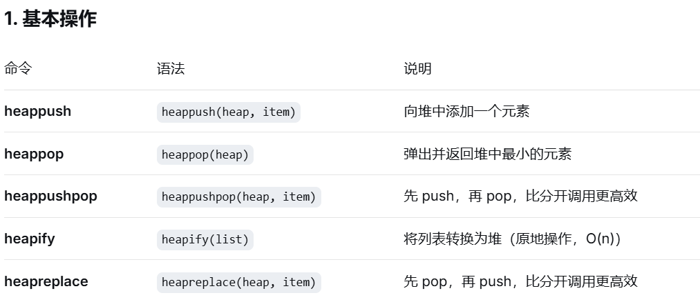
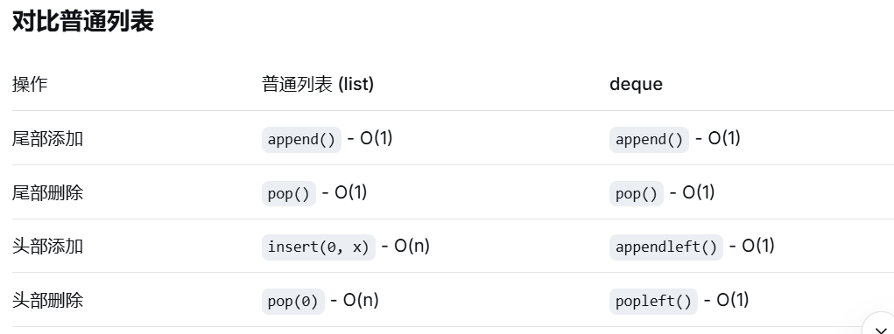

**排序**：
1. nums.sort() ##给nums排序，返回none ，如果 a = nums.sort()，那么a = none
2. intervals.sort(key=lambda p: p[0]) 这行代码的意思是：按照每个区间的第一个元素（左端点）进行排序

**数学运算**:
1. 向下取整：a//b
2. 向上取整：ceil(a // b)
3. 取余：a%b 
4. 指数：a ** b

**链表**：
1. 哨兵节点：dummy = ListNode(0,head) （=ListNode(next=head)）第一个节点为0，指向head
```python
class ListNode: # ListNode 类的定义
    def __init__(self, val=0, next=None):
        self.val = val      # 第一个参数：节点的值
        self.next = next    # 第二个参数：指向下一个节点
```
2. 空节点：dummy = ListNode()

**堆**：
1. heapify()：堆化(小顶堆) 把最小值放在上面
2. ListNode.__ lt __ = lambda a, b: a.val < b.val  # 让堆可以比较节点大小  自定义 链表比较大小的方法，使得堆可以给链表节点的值比较大小


**队列**：
1. deque（双端队列）：

**集合**：set()

**矩阵**：
1. cnt = **Counter**(c for row in board for c in row)  # 统计矩阵board中每个字符的出现次数 (Counter(nums)统计nums中各个元素的个数)
2. 上面这个方法的用法：cnt >= Counter(word)：检查矩阵中的字母数量是否大于等于单词需要的数量  （[79. Word Search](../hot%20100/回溯/79.%20Word%20Search.md) 方法二）

**无限迭代器**： 其中 count(i+1) 表示从i+1往后以步长为1 无限迭代

**检查空值的方法**：
```python
if not nums:  # ✅ 最常用，检查所有假值
    return None
if len(nums) == 0:  # ✅ 明确检查长度
    return None
if nums == []:  # ✅ 检查是否等于空列表
    return None
    
if nums is []:  # False ❌ 因为右边的[]是新创建的对象，内存地址不相同
```

**字典**：
1. {}**在 Python 中代表空字典**，关键特点：键值对存储，O(1) 的查找速度
2. **defaultdict(int)** 如果字典里面没有int，会自动创建并记录次数
3. 字典的一些常用使用方法：[763. Partition Labels](../hot%20100/贪心算法/763.%20Partition%20Labels.md) （参考答案第一行）
4. 

**二分查找**：bisect_left(arr,x) 输出在arr中第一个大于等于x的位置

**循环**：for _ in range(n)表示循环n次，每次计数给_，因此可以用于不关心循环计数值的时候使用

**切片：** ==python中的切片规则是左闭右开==
1. **反转列表**：vals`[::-1]`,反转vals列表
2. **切割数组**：如果想设一个数组a为数组b的n到m-1个元素，则可以设 a = b`[n:m]`
```python
# 列表就是Python的动态数组
arr = [10, 20, 30, 40, 50, 60]

# 基本切片
print(arr[1:4])      # [20, 30, 40]
print(arr[2:])       # [30, 40, 50, 60]
print(arr[:3])       # [10, 20, 30]
```
3. **切片：** t = s`[i:j+1]` 是 Python 的切片操作，适合可以用于切片的数据类型：
```python
s = "hello"
print(s[1:4])  # "ell" ✅
```

**将字符列表连接为字符串**：''.join()或者''''.join() e.x.:
```python
path = ['h', 'e', 'l', 'l', 'o'] # n = 5
result = ''.join(path) # 时间复杂度O(n) 
print(result)  # 输出: "hello"
# 将列表 ['h','e','l','l','o'] 变成字符串 "hello"
```

**二维数组**：
```python
# 创建3行4列的二维数组
arr_2d = [[0] * 4 for _ in range(3)]
arr_2d = [
    [0, 0, 0, 0],  # 第0行
    [0, 0, 0, 0],  # 第1行
    [0, 0, 0, 0]   # 第2行
]
```

cache装饰器：用于缓存函数结果，避免重复计算，显著提高函数性能。@cache （灵神17 动态规划 4min10S

leetcode注释快捷键：ctrl + “/？”键

nonlocal ans：表示 ans 是一个非局部变量，它既不是局部变量，也不是全局变量，而是闭包（外层函数）中的变量
在内层函数 `dfs` 中想要**修改**外层函数的 `ans` 变量，而不是创建一个新的局部变量
```python
def test():
    ans = 0
    def inner():
        nonlocal ans  # 声明 ans 是外层的变量
        ans = 1       # 修改外层的 ans
    inner()
    print(ans)  # 输出：1（被成功修改）
```

{}**在 Python 中代表空字典**，关键特点：键值对存储，O(1) 的查找速度


```python
st = Counter(p)  # st 是一个字典，记录p中每个字符出现的次数
st = set(p)  # 只存储p中出现的不同字符，不记录次数
```

self.s = s，将一个方法中的s保存为实例变量，供其他方法使用