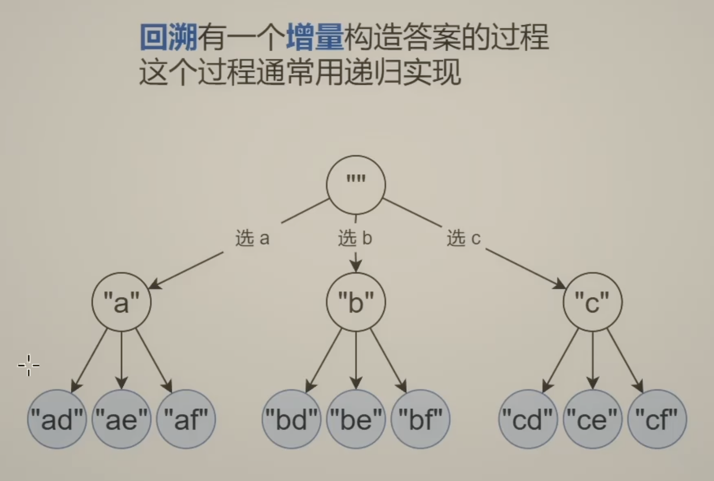
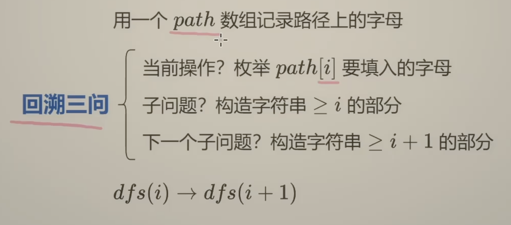
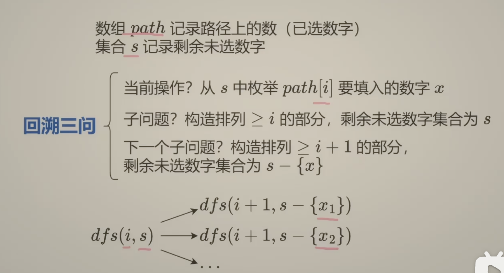
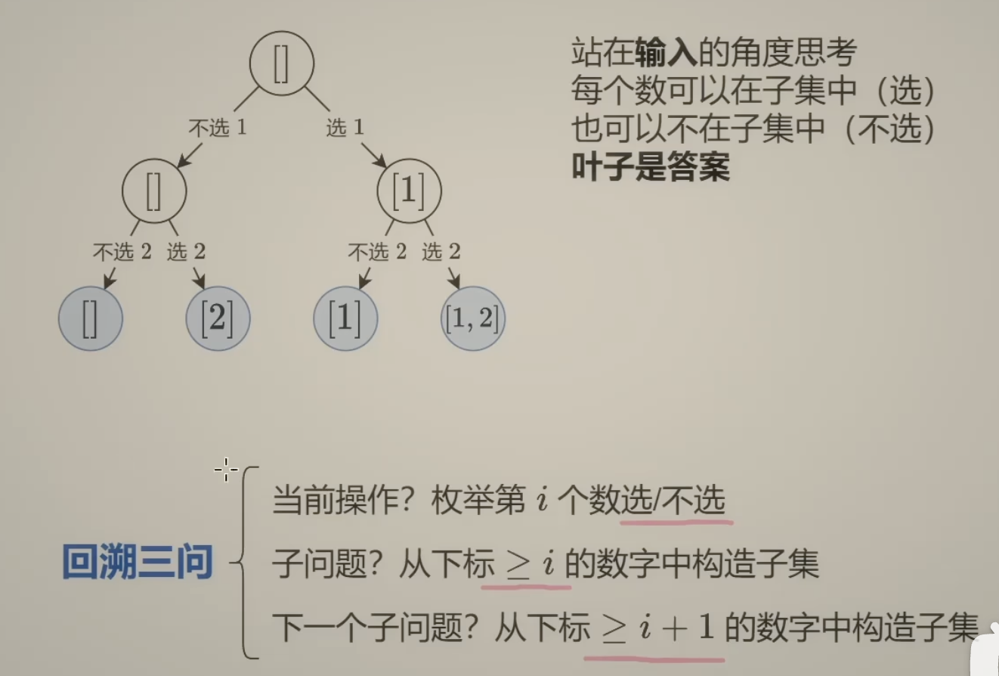
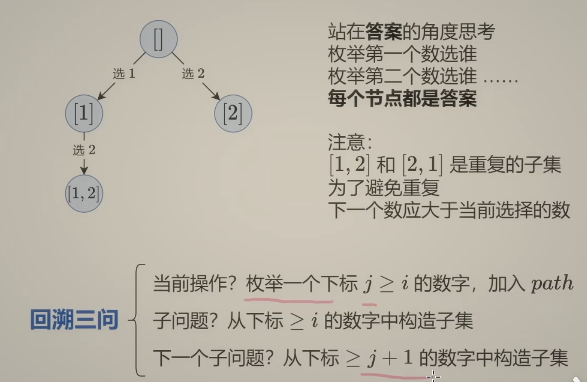

- 注意区分BFS 还是 DFS: 如果是 BFS 一般是写循环来实现; 如果是DFS则定义 def dfs 来实现 

#### 回溯：

**全排列**：
- 用数组path记录路径上的数（已选数字） 这一步可以用[0] * n 数组也可以用 [] 空数组（ 通过append 和 pop 来维护）
- 集合s 记录剩余未选的数字 
 

**子集型**：
- 每个元素都可以选/不选
- 因为子集长度不定 所以用空数组【】 所以要注意恢复现场 用append 和 pop 
 
                                                                       答案角度思考：每个长度都有可能是答案，每次递归都要记录答案

