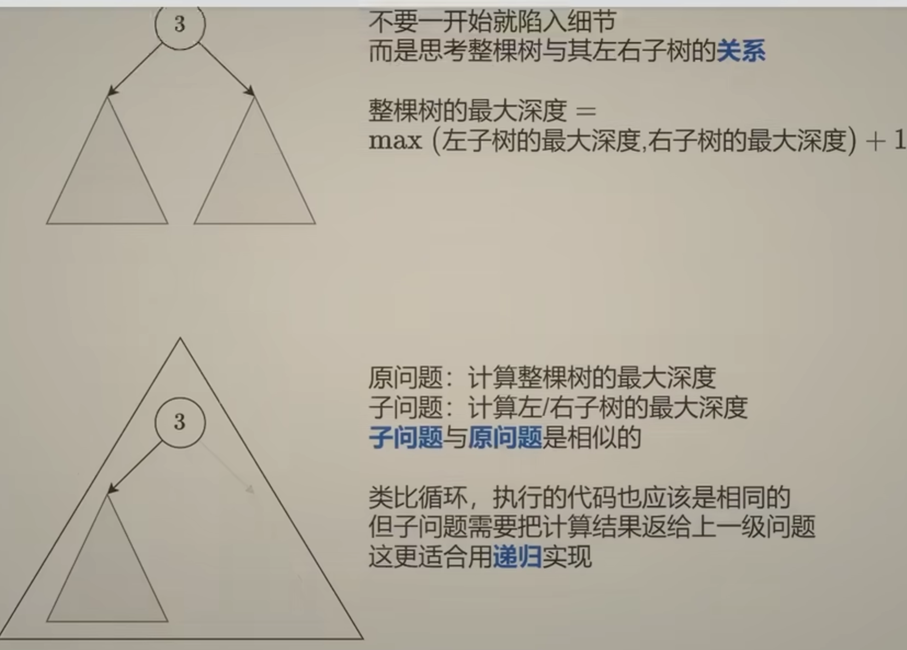
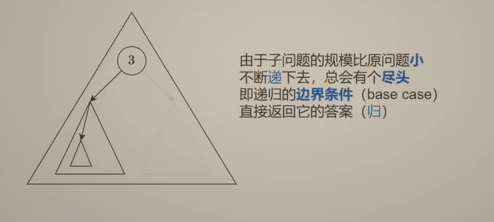
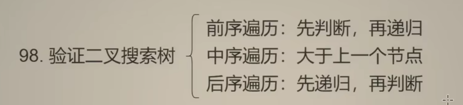
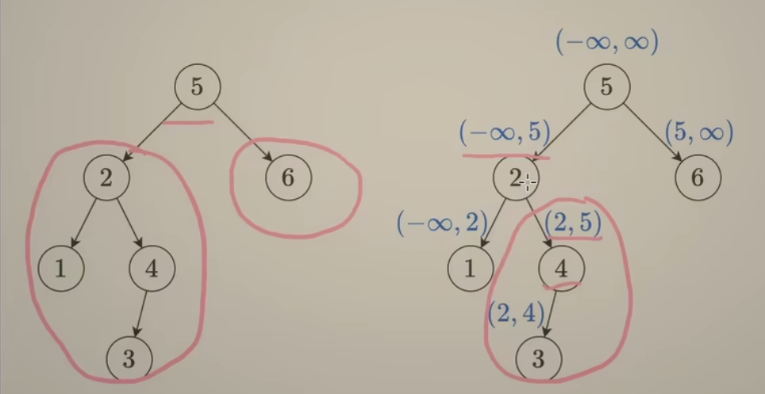

# 思路：
## 递归：

二叉树的边界条件是空节点，我们可以直接返回0作为答案

1. 二叉树要先找边界条件
2. 关键在于return，你想给上一个节点什么信息

# 题型：
## 二叉搜索树：
**定义**：对于一个节点来说，它的左子树所有节点值都小于它的值，它的右子树所有节点值也都大于它的值，并且它的左子树和右子树也必须是二叉搜索树

**先序遍历**：

1. 提出递归算法，除了传入节点还需要传入开区间范围，
2. 对于每个节点，先判断它的节点是否在开区间内，然后再往下递归
3. 如果往左边递归，那就把开区间的有边界更新为节点值，反之亦然
4. 先访问节点值，再递归左右子树的做法叫做前序遍历
5. 特别注意根节点（函数调用的入口），再往上它是没有节点的