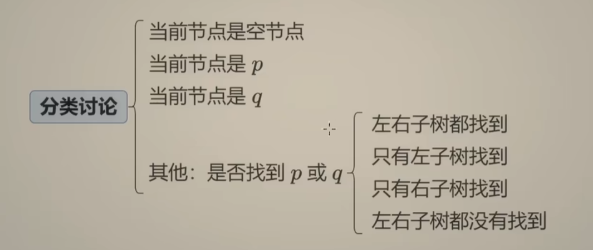
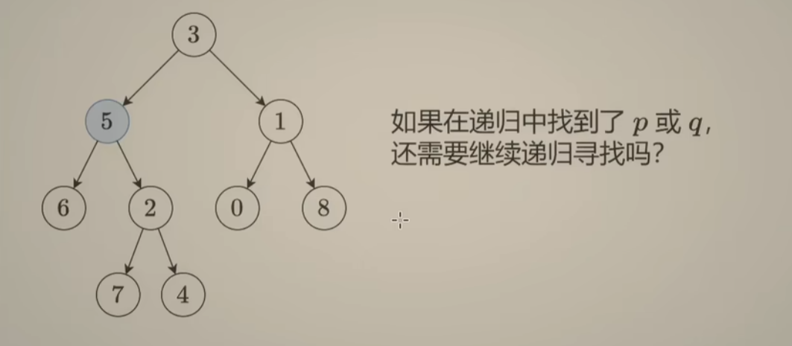
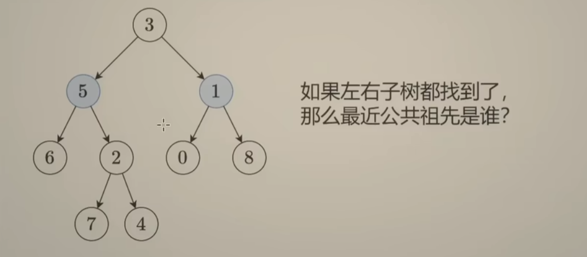
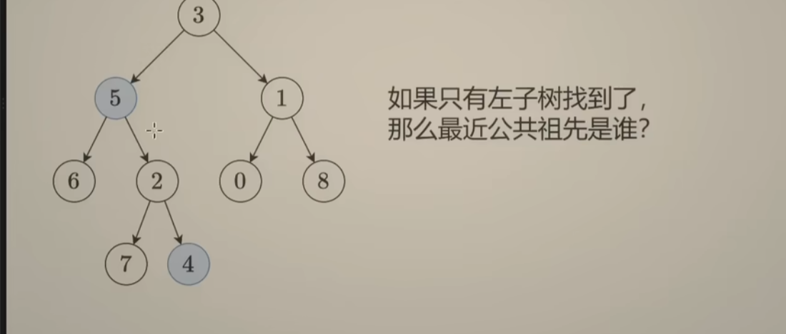
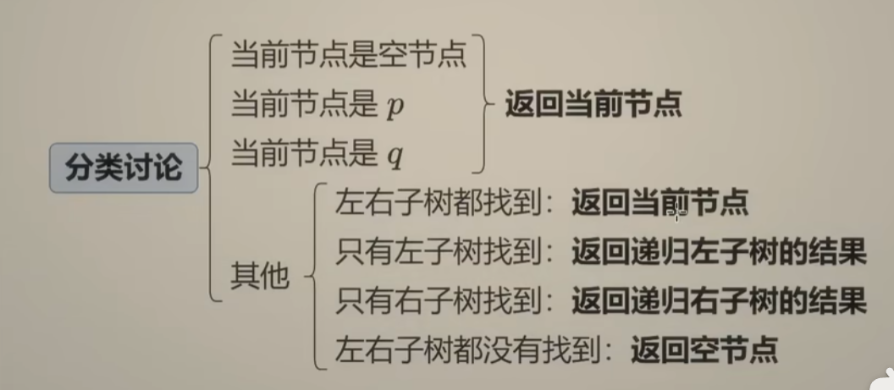

# 二叉树的最近公共祖先
分情况讨论：

空节点直接返回空节点
不需要继续递归了，如果p是5，那么q不管是5下面哪个节点，最近公共祖先都是5，所以不需要继续递归了，直接返回5就可以
**注意**：如果q是8，答案是3，不会在5下面，无论如何，5下面都不要递归，返回5并不代表最终答案就是5

左右子树都有，那么最近公共祖先就是当前节点

只在左子树找到了，最近公共祖先一定在左子树中，返回递归左子树后的结果
