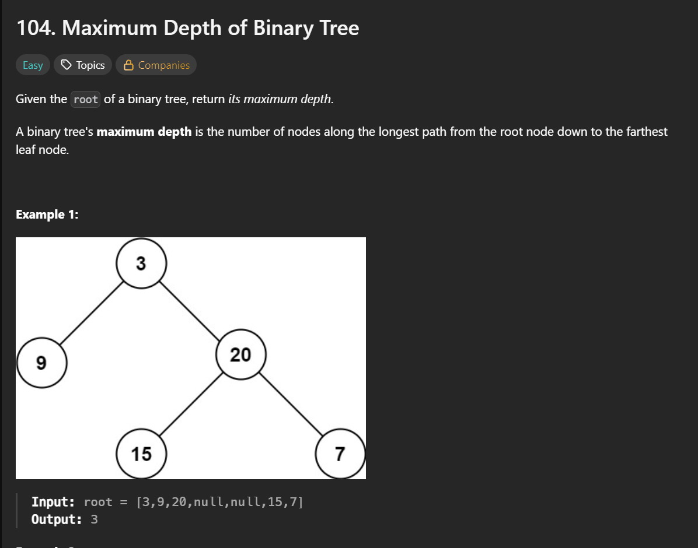

**刷题日期**：2026-1-21
**难度**：Easy

## 题目截图：
---


## 参考答案：
---
```python
# Definition for a binary tree node.
# class TreeNode:
#     def __init__(self, val=0, left=None, right=None):
#         self.val = val
#         self.left = left
#         self.right = right
class Solution:
    def maxDepth(self, root: Optional[TreeNode]) -> int:
        if root is None:
            return 0
        l_depth = self.maxDepth(root.left)
        r_depth = self.maxDepth(root.right)
        return max(l_depth,r_depth) + 1
```