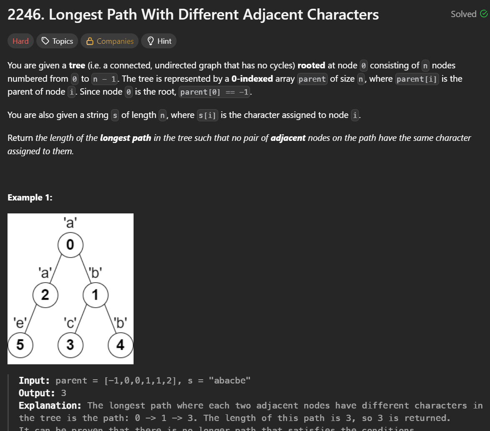
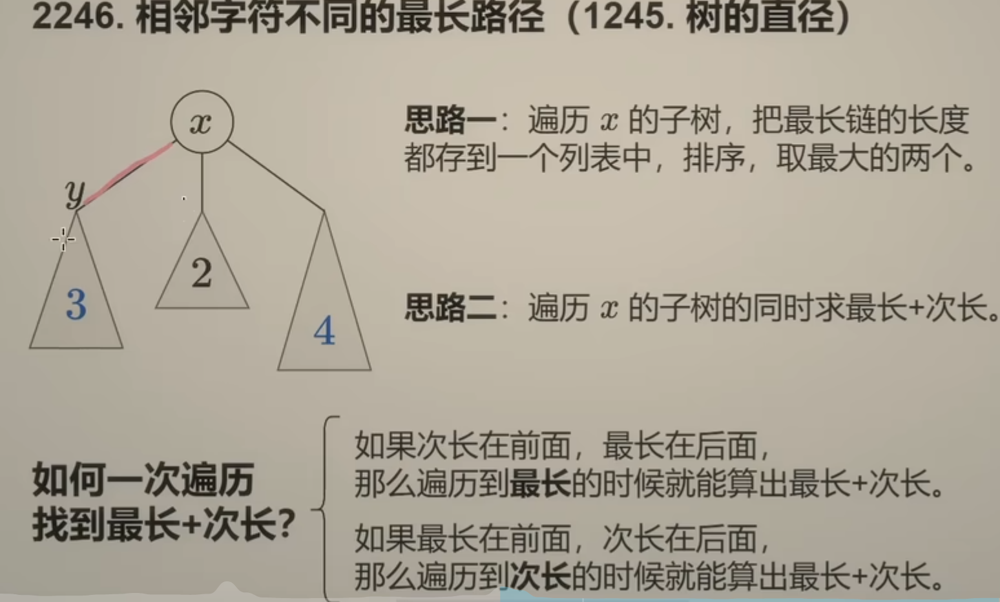
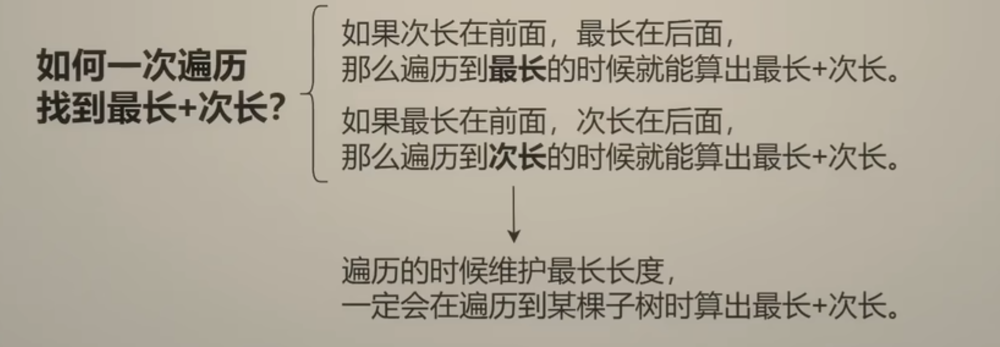

**刷题日期**：2026-2-15
**难度**：Medium

## 题目截图：
---

## 参考答案：
---
```python
class Solution:
    def longestPath(self, parent: List[int], s: str) -> int:
        n = len(parent)
        g = [[] for _ in range(n)]
        for i in range(1, n):
            g[parent[i]].append(i)
        ans = 0
        def dfs(x):
            nonlocal ans
            x_len = 0
            for y in g[x]:
                y_len = dfs(y) + 1
                if s[y] != s[x]:
                    ans = max(ans, x_len + y_len)
                    x_len = max(x_len, y_len)
            return x_len
        dfs(0)
        return ans + 1
```
## 解题思路：
---


