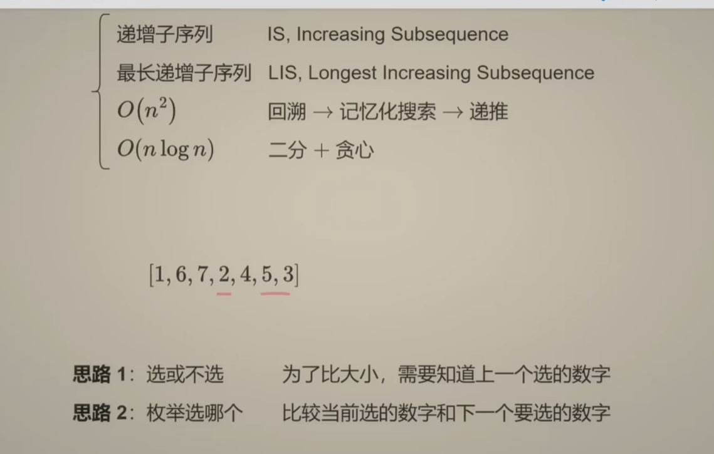
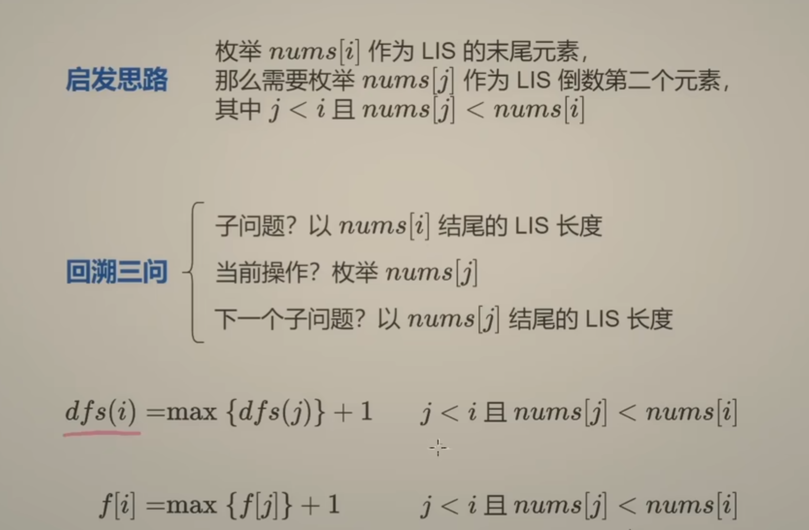
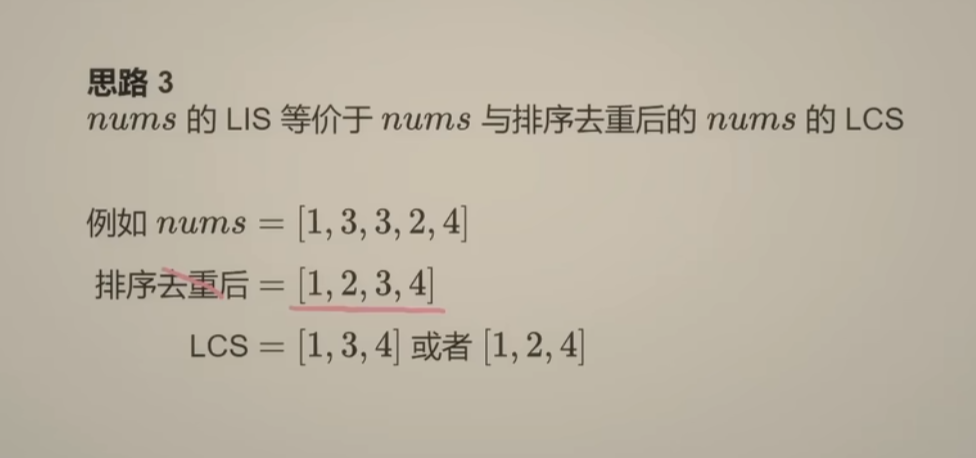
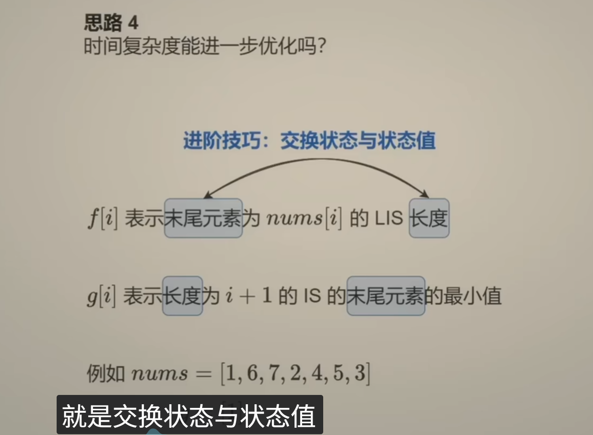
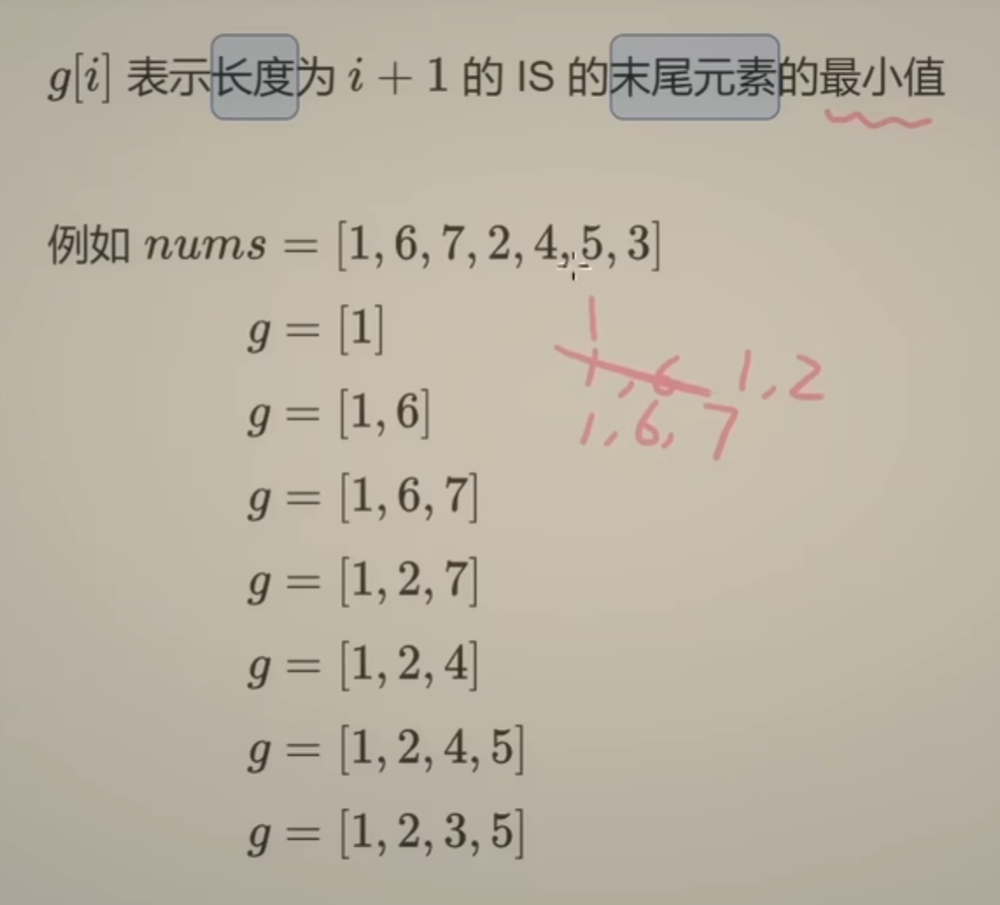
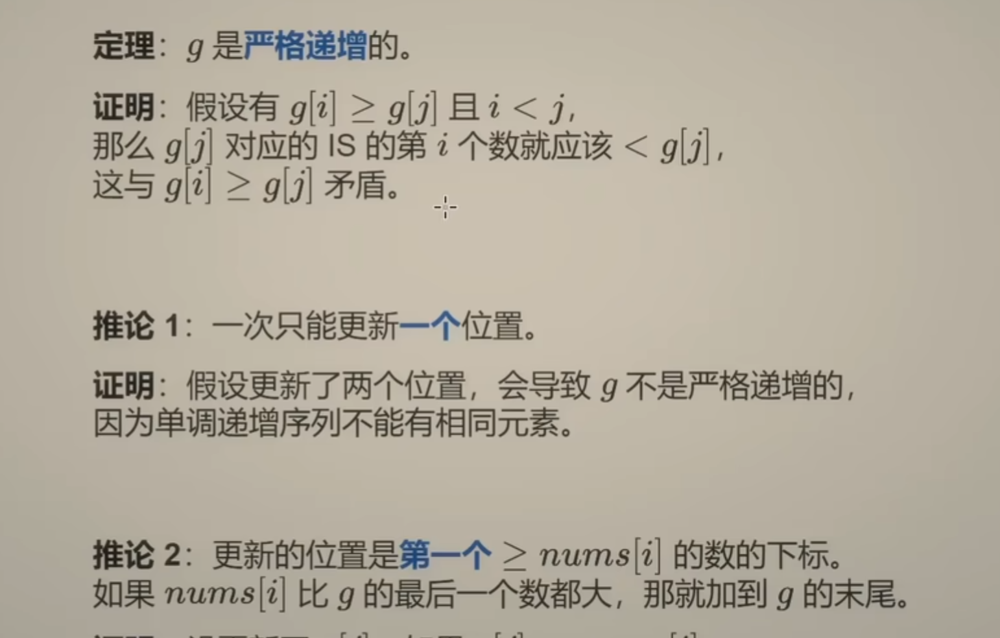
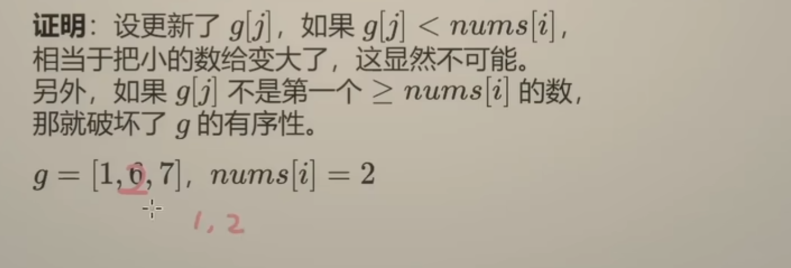
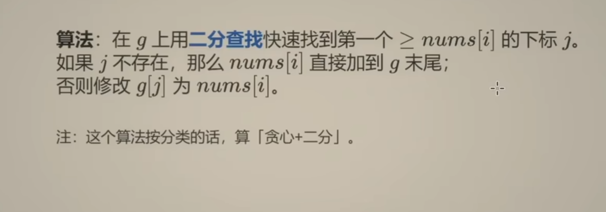
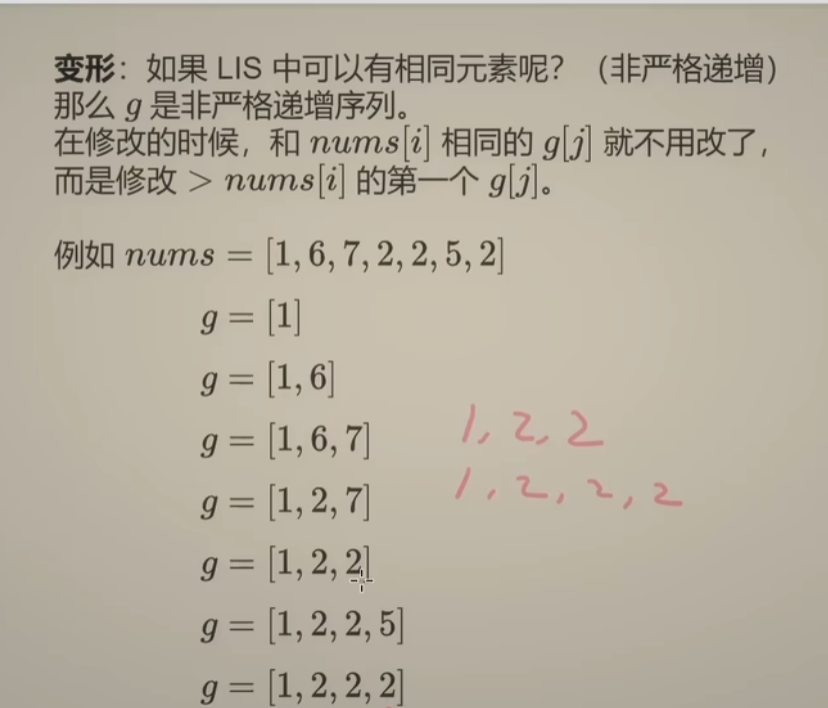

## 参考答案：
---
做法一：
```python
class Solution:
    def lengthOfLIS(self, nums: List[int]) -> int:
        n = len(nums)
        @cache
        def dfs(i):
            res = 0
            for j in range(i):
                if nums[j] < nums[i]:
                    res = max(res, dfs(j))
            return res + 1
       #ans = 0
       #for i in range(n):
       #ans = max(ans, dfs(i))
       #return ans
        return max(dfs(i) for i in range(n))
```
时间复杂度O(n^2) ，这里是O(n)个状态，每个状态需要O(n)的时间
由于有O(n)个状态，空间复杂度是O(n)

做法二：递推
```python
class Solution:
    def lengthOfLIS(self, nums: List[int]) -> int:
        n = len(nums)
        f = [0] * n
        for i in range(n):
            for j in range(i):
                if nums[j] < nums[i]:
                    f[i] = max(f[i], f[j])
            f[i] += 1
        return max(f)
```

做法四：
```python
class Solution:
    def lengthOfLIS(self, nums: List[int]) -> int:
        g = []
        for x in nums:
            j = bisect_left(g,x)
            if j == len(g):
                g.append(x)
            else:
                g[j] = x
        return len(g)
```
时间复杂度：O(nlogn)

## 题目解析：
---
 

把记忆化搜索改成递推：把dfs改成f数组，把递归改成循环
 做法三：可以将nums排序去重后，再与nums计算最长公共子序列 时间复杂度O(n^2)
 
 做法四：犹豫没有重叠子问题，是不能算作动态规划的，贪心
 进阶优化时间复杂度
 
 
 
 
变形：对应到代码上就是把bisect_left 改为bisect_right
