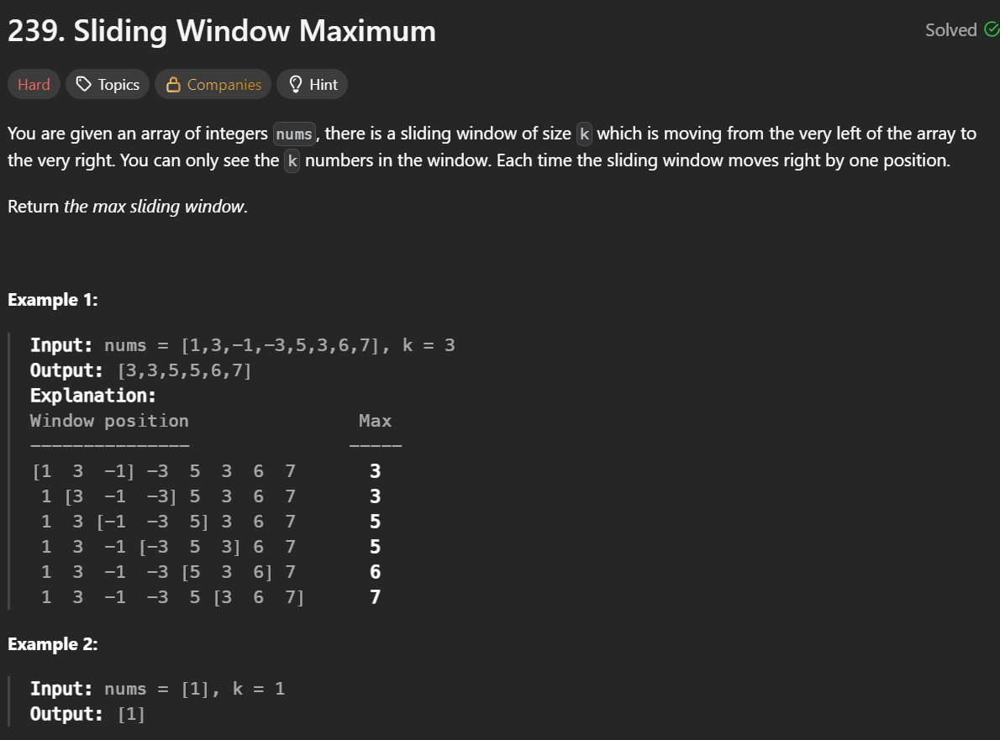
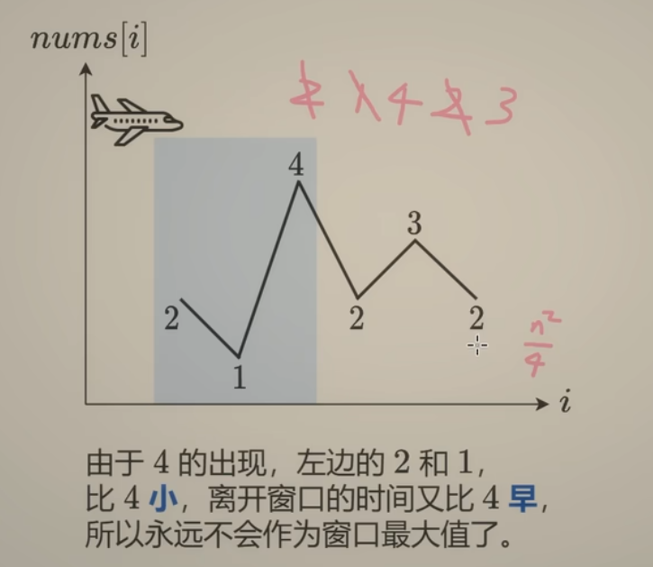
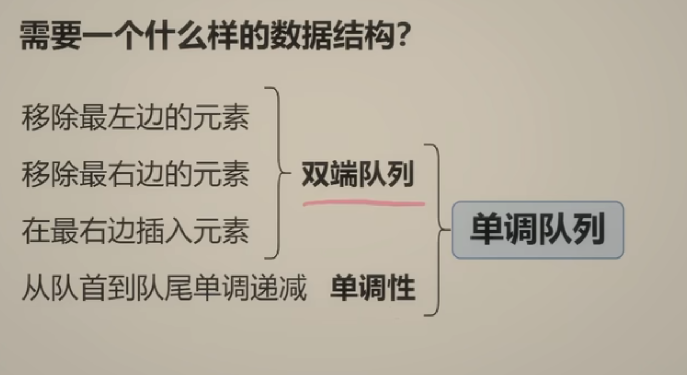

**刷题日期**：2026-2-19
**难度**：Medium
## 题目截图：
---


## 参考答案：
---
```python
class Solution:
    def maxSlidingWindow(self, nums: List[int], k: int) -> List[int]:
        ans =[]
        q = deque()
        for i, x in enumerate(nums):
            # 1.入
            while q and nums[q[-1]] <= x:
                q.pop()
            q.append(i)
            # 2.出
            if i-q[0] >= k:
                q.popleft()
            # 3.记录答案
            if i >= k-1:
                ans.append(nums[q[0]])
        return ans
```
## 解题思路：
---


