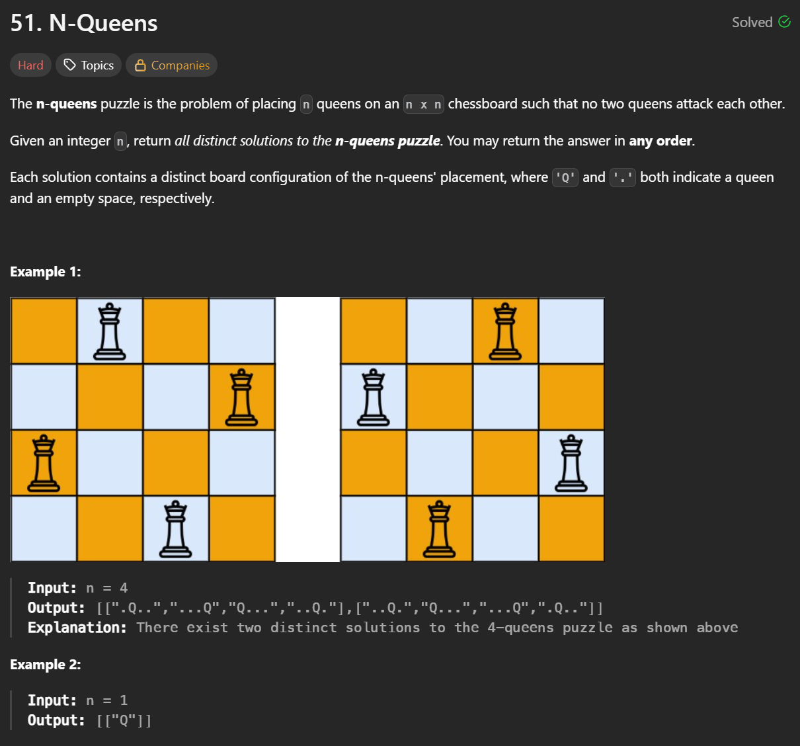
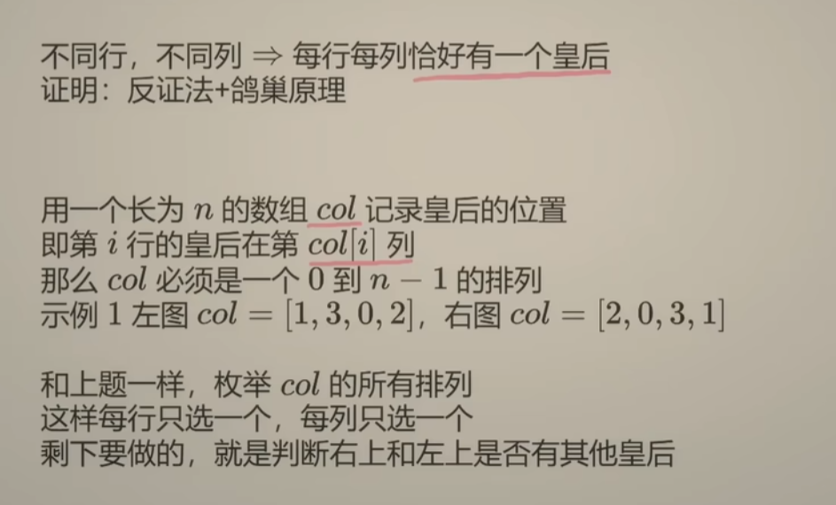
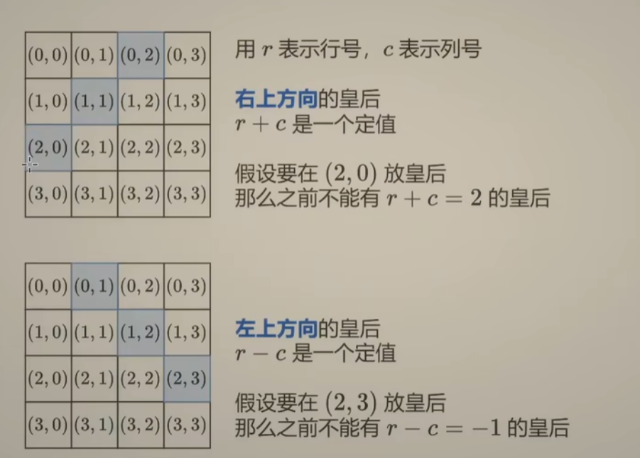

**刷题日期**：2026-1-28
**难度**：Hard

## 题目截图：
---


## 参考答案：
---
做法一： 时间复杂度 O(n^2 * n!)
```python
class Solution:
    def solveNQueens(self, n: int) -> List[List[str]]:
        ans = []
        col = [0] * n
        def valid(r,c):
            for R in range(r): ##判断在r之前的皇后，有没有和当前的皇后在一个对角线上
                C = col[R]
                if r+c == R+C or r-c == R-C:
                    return False
            return True
 
        def dfs(r, s):
            if r == n:
                ans.append(['.'*c + 'Q' + '.'*(n - 1 - c) for c in col])
                return
            for c in s:
                if valid(r,c):
                    col[r] = c
                    dfs(r+1, s-{c})
        dfs(0,set(range(n)))
        return ans
        
class Solution:
    def solveNQueens(self, n: int) -> List[List[str]]:
        ans = []
        col = [0] * n
        # 可以省略 def valid(r,c):
  
        def dfs(r, s):
            if r == n:
                ans.append(['.'*c + 'Q' + '.'*(n - 1 - c) for c in col])
                return
            for c in s:
                if all(r+c != R+col[R] and r-c != R-col[R] for R in range(r)):
                    col[r] = c
                    dfs(r+1, s-{c})
        dfs(0,set(range(n)))
        return ans
```
**注意**：
1. 通过valid判断是否为对角线
2. r 代表行 s代表当前这一行还有那几个元素可以选

## 解题思路：
---


