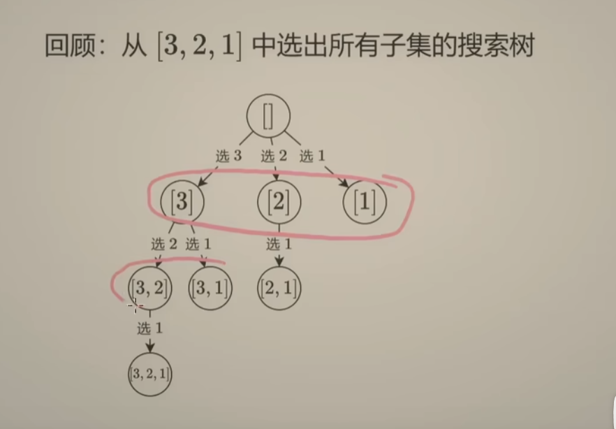
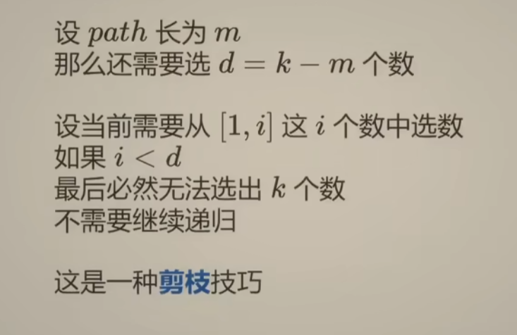

**刷题日期**：2026-1-27
**难度**：Medium
## 题目截图：
---


## 参考答案：
---
```python
class Solution:
    def combine(self, n: int, k: int) -> List[List[int]]:
        ans = []
        path = []
        def dfs(i):
            d = k -len(path)
            # if i < d:
            #    return
            if len(path) == k:
                ans.append(path.copy())
                return
            for j in range(i, d-1, -1):
                path.append(j)
                dfs(j-1)
                path.pop()
        dfs(n)
        return ans
```
**注意**：
1. 可以把剪枝部分放在for循环中，因为当j取值在i到d范围内时，小于d则说明，无法满足选k个数的要求
因为：每次循环j的取值会逐渐变小，但是在同一层搜索树中，d = k - len(path) 是不变的，因此当j变小（即下一次递归中的i）变小时，到达某一值则无法满足选k个数的要求，因此可以放在循环中来实现
## 组合型：
---



倒序枚举是为了满足使得 i < d 可以判断需要继续递归