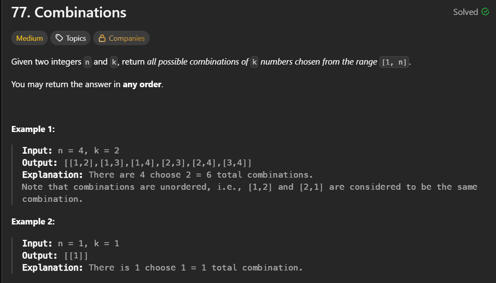
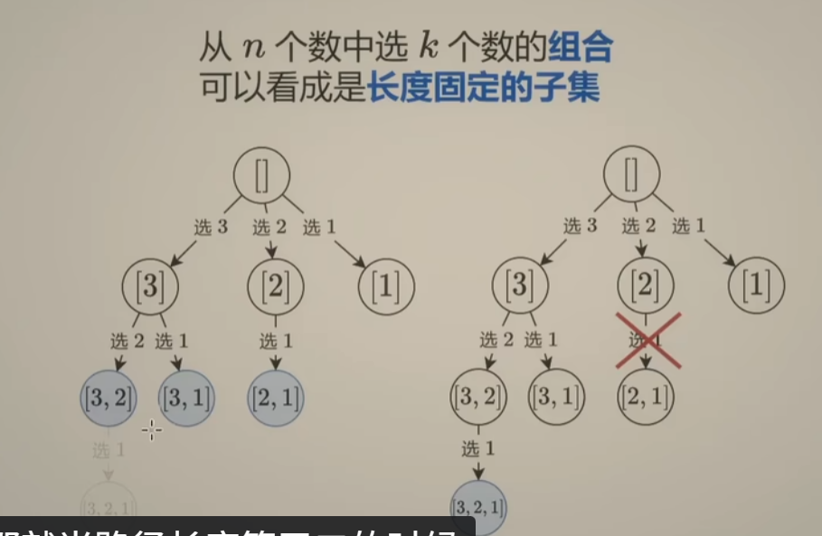

## 题目截图：
---


## 参考答案：
---
```python
class Solution:
    def combine(self, n: int, k: int) -> List[List[int]]:
        ans = []
        path = []
        def dfs(i):
            d = k -len(path)
            # if i < d:
            #    return
            if len(path) == k:
                ans.append(path.copy())
                return
            for j in range(i, d-1, -1):
                path.append(j)
                dfs(j-1)
                path.pop()
        dfs(n)
        return ans
```
**注意**：
1. 可以把剪枝部分放在for循环中，因为当
## 组合型：
---



倒序枚举是为了满足使得 i < d 可以判断需要继续递归